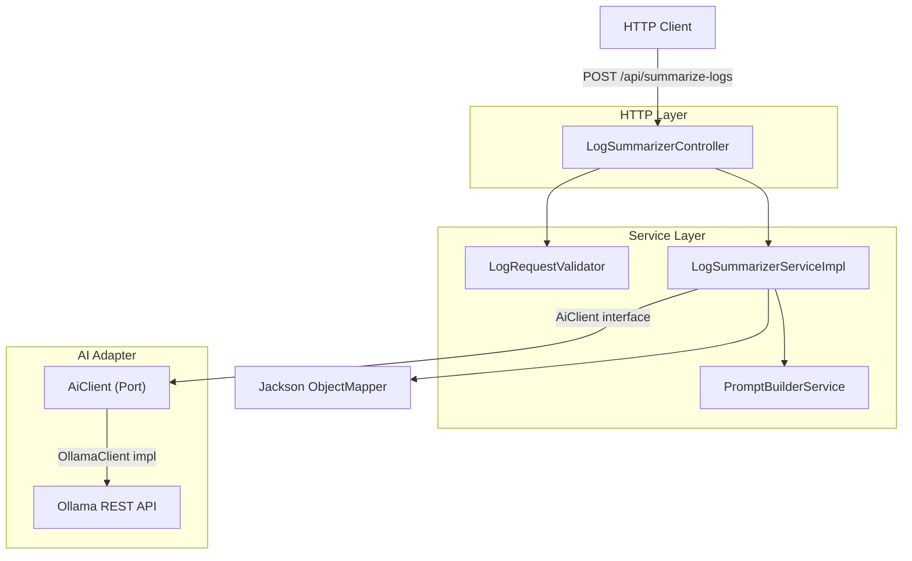
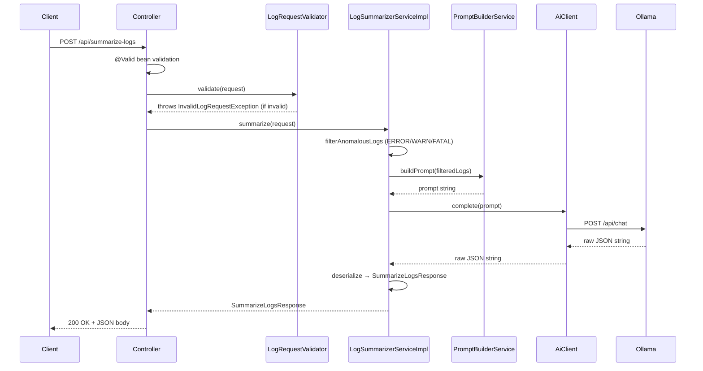
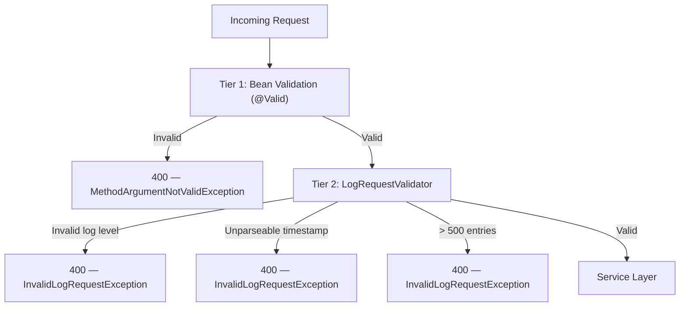
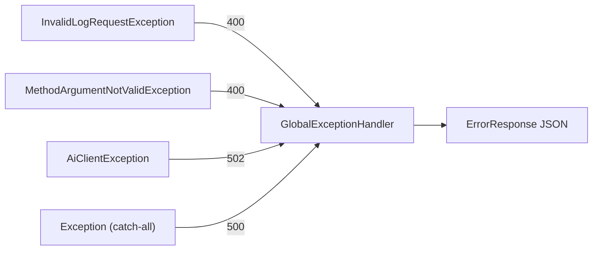
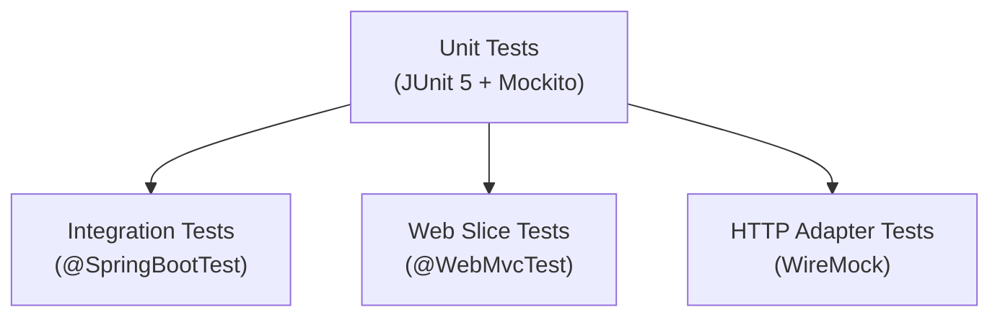

# AI-Powered Log Anomaly Summarizer

A production-ready REST API that accepts structured log entries and returns a human-readable anomaly summary, key error signatures, and a recommended action — powered by a local LLM via Ollama.

---

## Table of Contents

1. [Project Overview](#project-overview)
2. [Architecture](#architecture)
3. [Design Decisions](#design-decisions)
4. [Technology Stack](#technology-stack)
5. [Package Structure](#package-structure)
6. [API Documentation](#api-documentation)
7. [Example Request & Response](#example-request--response)
8. [Build Instructions](#build-instructions)
9. [Local Run Instructions](#local-run-instructions)
10. [Docker Instructions](#docker-instructions)
11. [Ollama Setup](#ollama-setup)
12. [Prompt Engineering Strategy](#prompt-engineering-strategy)
13. [Validation Strategy](#validation-strategy)
14. [Error Handling Strategy](#error-handling-strategy)
15. [Testing Strategy](#testing-strategy)
16. [Trade-offs](#trade-offs)
17. [Future Improvements](#future-improvements)

---

## Project Overview

This service exposes a single endpoint — `POST /api/summarize-logs` — that accepts a batch of structured log entries and returns an AI-generated anomaly report. It is designed to assist on-call engineers by condensing noisy log output into actionable summaries without requiring manual log triage.

**Core capabilities:**

- Accepts up to 500 log entries per request
- Filters to anomalous log levels (ERROR, WARN, FATAL) before sending to the LLM
- Returns a structured JSON response: summary, key error signatures, and a recommendation
- Provider-agnostic AI layer — swap Ollama for any other LLM with a single properties change
- Fully containerised with Docker Compose (app + Ollama)

---

## Architecture

The service follows Clean Architecture / Hexagonal (Ports and Adapters) principles layered on Spring Boot conventions. The service layer is fully decoupled from the AI provider via the `AiClient` interface.



### Request Lifecycle



---

## Design Decisions

### Provider-Agnostic AI Port

The `AiClient` interface has a single method:

```java
String complete(String prompt)
```

The service layer depends only on this interface. Switching AI providers (Ollama → Claude → GPT-4) requires:

1. Implementing `AiClient` in a new class under `ai/<provider>/`
2. Annotating it with `@ConditionalOnProperty(name = "ai.provider", havingValue = "<provider>")`
3. Changing one line in `application.properties`

No service layer code changes are ever needed.

### Raw String Return from AiClient

`AiClient.complete()` returns a raw `String` rather than a typed DTO. This keeps the port boundary thin and avoids coupling it to any response schema. Deserialization is the service layer's responsibility, which means the prompt's JSON schema contract lives in one place: `PromptBuilderService`.

### Two-Tier Validation

Validation is split to keep concerns separate:

- **Tier 1 — Bean Validation:** `@Valid` on the controller enforces structural constraints (`@NotEmpty`, `@NotBlank`) that can be expressed as annotations on DTOs.
- **Tier 2 — Semantic Validation:** `LogRequestValidator` handles rules that require logic: valid log level enum values, parseable ISO-8601 timestamps, and maximum batch size (500).

### Pre-filtering Before LLM Call

Only ERROR, WARN, and FATAL entries are forwarded to the LLM. This reduces token usage, lowers latency, and keeps the prompt focused on anomalies — exactly what the output is meant to summarise.

### No Try/Catch in the Controller

All exception handling is centralised in `GlobalExceptionHandler` (`@RestControllerAdvice`). Controllers are kept thin and cannot accidentally swallow or misformat errors.

---

## Technology Stack

| Component | Detail |
|---|---|
| Language | Java 21 |
| Framework | Spring Boot 4.0.6 |
| Build Tool | Maven |
| AI Provider | Ollama (llama3.2:1b) via provider-agnostic `AiClient` interface |
| HTTP Client | Spring `RestClient` |
| JSON | Jackson with `@ConfigurationProperties` binding |
| Boilerplate reduction | Lombok (`@Data`, `@Builder`, `@RequiredArgsConstructor`) |
| Validation | Jakarta Bean Validation + custom `LogRequestValidator` |
| Logging | Logback with JSON output on `prod` profile + MDC request tracing |
| Testing | JUnit 5, Mockito, WireMock, `@WebMvcTest`, `@SpringBootTest` |
| Containerisation | Docker multi-stage build + Docker Compose |

---

## Package Structure

```
src/main/java/com/neaz/logsummarizer/
├── LogSummarizerApplication.java
├── controller/
│   └── LogSummarizerController.java        # HTTP entry point; thin, no business logic
├── service/
│   ├── LogSummarizerService.java           # Interface
│   └── LogSummarizerServiceImpl.java       # Orchestrates validation → filter → prompt → AI → parse
├── ai/
│   ├── AiClient.java                       # Port interface: String complete(String prompt)
│   ├── PromptBuilderService.java           # All prompt construction logic
│   └── ollama/
│       ├── OllamaClient.java               # Adapter: implements AiClient via RestClient
│       ├── OllamaRequest.java              # Ollama REST request DTO
│       └── OllamaResponse.java            # Ollama REST response DTO
├── config/
│   ├── AiProviderConfig.java              # @ConfigurationProperties for ai.* namespace
│   ├── RestClientConfig.java              # RestClient bean wired with Ollama base URL + timeout
│   └── JacksonConfig.java                # ObjectMapper configuration
├── dto/
│   ├── LogEntry.java                      # Per-log-line input model
│   ├── SummarizeLogsRequest.java          # API request wrapper
│   └── SummarizeLogsResponse.java        # API response: summary + signatures + recommendation
├── exception/
│   ├── AiClientException.java             # Unchecked; thrown by OllamaClient on transport error
│   ├── InvalidLogRequestException.java    # Thrown by LogRequestValidator
│   ├── ErrorResponse.java                 # Uniform error DTO returned to callers
│   └── GlobalExceptionHandler.java        # @RestControllerAdvice; maps all exceptions → HTTP
├── util/
│   └── LogLevelUtils.java                 # Enum helpers; anomaly level check
└── validator/
    └── LogRequestValidator.java           # Semantic validation: log level, timestamp, batch size
```

---

## API Documentation

### `POST /api/summarize-logs`

Accepts a batch of structured log entries and returns an AI-generated anomaly summary.

#### Request

| Field | Type | Required | Constraints |
|---|---|---|---|
| `logs` | `LogEntry[]` | Yes | 1–500 entries |
| `logs[].timestamp` | `string` | Yes | ISO-8601 (`2025-10-15T10:00:05Z`) |
| `logs[].level` | `string` | Yes | `DEBUG`, `INFO`, `WARN`, `ERROR`, `FATAL` |
| `logs[].service` | `string` | Yes | Non-blank |
| `logs[].message` | `string` | Yes | Non-blank |

#### Response — 200 OK

| Field | Type | Description |
|---|---|---|
| `summary` | `string` | Human-readable anomaly narrative |
| `key_error_signatures` | `string[]` | Distinct error patterns extracted from logs |
| `recommendation` | `string` | Suggested remediation action |

#### Error Responses

| Status | Cause |
|---|---|
| `400 Bad Request` | Missing/invalid fields, invalid log level, unparseable timestamp, >500 entries |
| `502 Bad Gateway` | Ollama unreachable or returned an unusable response |
| `500 Internal Server Error` | Unexpected server fault |

All error responses use the `ErrorResponse` shape:

```json
{
  "status": 400,
  "error": "Bad Request",
  "message": "Log level 'VERBOSE' is not valid",
  "timestamp": "2025-10-15T10:00:07Z"
}
```

---

## Example Request & Response

### Request

```bash
curl -X POST http://localhost:8080/api/summarize-logs \
  -H "Content-Type: application/json" \
  -d '{
    "logs": [
      {
        "timestamp": "2025-10-15T10:00:01Z",
        "level": "INFO",
        "service": "payment-service",
        "message": "Payment request received for order #98234"
      },
      {
        "timestamp": "2025-10-15T10:00:05Z",
        "level": "ERROR",
        "service": "payment-service",
        "message": "Database connection timed out after 3001ms"
      },
      {
        "timestamp": "2025-10-15T10:00:06Z",
        "level": "ERROR",
        "service": "payment-service",
        "message": "Retry attempt 1/3 failed — upstream DB unreachable"
      },
      {
        "timestamp": "2025-10-15T10:00:09Z",
        "level": "FATAL",
        "service": "payment-service",
        "message": "Circuit breaker opened — service entering degraded mode"
      }
    ]
  }'
```

### Response

```json
{
  "summary": "The payment-service experienced a cascading database connectivity failure. Starting at 10:00:05Z, connection attempts to the upstream database began timing out after 3001ms. Retry logic was triggered but exhausted without success, ultimately causing the circuit breaker to open at 10:00:09Z and placing the service in a degraded state. No payments can be processed until database connectivity is restored.",
  "key_error_signatures": [
    "Database connection timed out after 3001ms",
    "Retry attempt failed — upstream DB unreachable",
    "Circuit breaker opened — service entering degraded mode"
  ],
  "recommendation": "Verify that the database host is reachable from the payment-service network. Check connection pool settings and database server health. Once connectivity is restored, manually reset the circuit breaker or restart the service to resume normal operation."
}
```

---

## Build Instructions

### Prerequisites

- Java 21+
- Maven 3.9+

### Compile and run all tests

```bash
mvn clean verify
```

### Package (skip tests)

```bash
mvn clean package -DskipTests
```

### Run the packaged JAR

```bash
java -jar target/log-summarizer-*.jar
```

---

## Local Run Instructions

Running locally requires Ollama to be running on the host machine before starting the application.

### Step 1 — Install and start Ollama

**macOS / Linux:**
```bash
curl -fsSL https://ollama.com/install.sh | sh
ollama serve
```

**Windows:**
Download and run the installer from [https://ollama.com/download](https://ollama.com/download). Ollama starts automatically as a background service — no need to run `ollama serve`.

### Step 2 — Pull the model

```bash
ollama pull llama3.2:1b
```

### Step 3 — Start the application

```bash
mvn spring-boot:run
```

The API will be available at `http://localhost:8080`.

---

## Docker Instructions

Docker Compose starts both the application and an Ollama container. The model must be pulled once after first start.

### Start the full stack

```bash
docker compose up --build
```

### Pull the model (first time only)

```bash
docker exec -it ollama ollama pull llama3.2:1b
```

### Stop the stack

```bash
docker compose down
```

### Configuration

The `application-docker.properties` profile overrides the Ollama base URL to use the Docker service name:

```properties
ai.ollama.base-url=http://ollama:11434
```

This is activated automatically when running inside Docker Compose via the `SPRING_PROFILES_ACTIVE=docker` environment variable set in `docker-compose.yml`.

---

## Ollama Setup

Ollama is used as the local LLM runtime. The application communicates with it over its REST API.

### Default configuration

```properties
ai.provider=ollama
ai.ollama.base-url=http://localhost:11434
ai.ollama.model=llama3.2:1b
ai.ollama.timeout-seconds=30
```

### Switching models

Change `ai.ollama.model` in `application.properties` to any model available in your local Ollama instance:

```properties
ai.ollama.model=mistral
```

Then pull it:

```bash
ollama pull mistral
```

### Switching AI providers

The `AiClient` interface makes provider switching a configuration-only change:

```properties
ai.provider=claude  # activates ClaudeClient if implemented
```

No service layer changes are required.

---

## Prompt Engineering Strategy

All prompt construction is isolated in `PromptBuilderService`. The final prompt sent to the LLM for the example request above looks like this:

```
You are a Senior Site Reliability Engineer (SRE) analysing application logs.

Your tasks:
- Identify recurring failures and unusual patterns
- Detect cascading failures and possible causal relationships
- Infer root causes from the evidence provided
- Provide concrete, actionable remediation recommendations

=== Log Statistics ===
Total Logs    : 4
Error Count   : 2
Warning Count : 0
Fatal Count   : 1
Info Count    : 1
Debug Count   : 0
Affected Services: payment-service

=== Top Recurring Messages ===
  1. (×2) Database connection timed out
  2. (×1) Circuit breaker opened — service entering degraded mode

=== Top Error Signatures (normalised) ===
  1. (×2) database connection timed out after {n}ms
  2. (×1) circuit breaker opened

=== Log Entries ===
[2025-10-15T10:00:05Z] [ERROR] [payment-service] Database connection timed out after 3001ms
[2025-10-15T10:00:06Z] [ERROR] [payment-service] Retry attempt 1/3 failed — upstream DB unreachable
[2025-10-15T10:00:09Z] [FATAL] [payment-service] Circuit breaker opened — service entering degraded mode

=== Output Instructions ===
Return ONLY valid JSON matching the schema below.
Do NOT return markdown. Do NOT include explanations. Do NOT wrap the output in code fences.
Keep the summary concise. Base all conclusions only on the evidence above.

{
  "summary": "string",
  "key_error_signatures": ["string"],
  "recommendation": "string"
}
```

### Why This Prompt Was Chosen

- **Provides operational context** by assigning the model an SRE role, steering it toward incident-focused language rather than generic summaries.
- **Reduces hallucinations** by explicitly instructing the model to base all conclusions only on the evidence provided — preventing invented metrics or fabricated service names.
- **Uses aggregated statistics** (counts, top recurring messages, normalised error signatures) to surface patterns concisely without repeating raw log lines, reducing token usage.
- **Enforces deterministic JSON output** by embedding the exact schema and forbidding markdown fences, enabling reliable Jackson deserialization without post-processing.
- **Focuses on anomaly detection, root-cause analysis, and actionable recommendations** through the four explicit task bullets, ensuring the model's output is operationally useful rather than descriptive.

The service deserializes the model's raw string output directly into `SummarizeLogsResponse` using Jackson. If deserialization fails, the exception propagates and is handled by `GlobalExceptionHandler` as a 502.

---

## Validation Strategy

Validation is split into two tiers to separate structural from semantic concerns.



### Tier 1 — Bean Validation

Applied via `@Valid` on the controller method parameter. Catches:

- `logs` list missing or empty (`@NotEmpty`)
- Any `LogEntry` field blank or null (`@NotBlank`)

### Tier 2 — LogRequestValidator

Catches semantic rules that cannot be expressed as annotations:

| Rule | Detail |
|---|---|
| Valid log level | Value must match `DEBUG`, `INFO`, `WARN`, `ERROR`, or `FATAL` (case-insensitive) |
| Parseable timestamp | Must be a valid ISO-8601 instant |
| Maximum batch size | No more than 500 log entries per request |

---

## Error Handling Strategy

All exceptions are handled centrally by `GlobalExceptionHandler` (`@RestControllerAdvice`). The controller layer contains no try/catch blocks.



| Exception | HTTP Status | Cause |
|---|---|---|
| `InvalidLogRequestException` | 400 | Semantic validation failure |
| `MethodArgumentNotValidException` | 400 | Bean validation failure (`@Valid`) |
| `AiClientException` | 502 | Ollama unreachable, timed out, or returned unparseable output |
| `Exception` | 500 | Unexpected server error |

All error responses use the `ErrorResponse` DTO — the application never surfaces Spring's default Whitelabel error page.

---

## Testing Strategy



| Test Class | Type | Scope |
|---|---|---|
| `LogSummarizerControllerTest` | `@WebMvcTest` | HTTP layer: routing, request validation, response status codes, error shape |
| `LogSummarizerServiceImplTest` | JUnit 5 + Mockito | Service orchestration: filtering, prompt delegation, AI response parsing, edge cases |
| `PromptBuilderServiceTest` | JUnit 5 | Prompt structure: correct field ordering, log formatting, schema inclusion |
| `OllamaClientTest` | JUnit 5 + WireMock | HTTP adapter: successful calls, timeouts, non-200 responses, malformed bodies |
| `LogRequestValidatorTest` | JUnit 5 | All validation rules: each valid/invalid case in isolation |
| `LogSummarizerIntegrationTest` | `@SpringBootTest` | Full request-to-response round-trip using a `TestAiClient` stub |

### Key testing rules

- **Never call real Ollama in CI.** Integration tests replace `OllamaClient` with a `MockAiClient` via `@TestConfiguration` that returns fixed JSON.
- **WireMock** is used only in `OllamaClientTest` to verify the HTTP adapter behaviour at the network level.
- **`@WebMvcTest`** loads only the web layer, keeping controller tests fast and focused.

---

## Trade-offs

| Decision | Benefit | Cost |
|---|---|---|
| `AiClient` returns raw `String` | Port stays thin; no schema coupling at the interface | Service layer must handle malformed AI output; deserialization failures surface as 502 |
| Pre-filter to ERROR/WARN/FATAL | Fewer tokens, faster response, focused output | INFO/DEBUG entries are invisible to the AI — a miscategorised log is silently excluded |
| Single `POST /api/summarize-logs` endpoint | Simple, focused API surface | No streaming, no partial results; long batches block until the LLM responds |
| Ollama as default provider | Fully local, no API keys, no data leaves the host | Slower inference than hosted APIs; requires Ollama to be running separately |
| `@ConditionalOnProperty` for provider switching | Zero-code provider swap | All providers must be on the classpath; unused providers add build weight |
| Synchronous request handling | Simple to reason about and test | A slow LLM response ties up the HTTP thread; no async/reactive support |
| Jackson deserialization of LLM output | Structured response with type safety | Prompt must be carefully engineered; LLM non-compliance causes a 502 |

---

## Future Improvements

- **Streaming responses** — Use Spring's `SseEmitter` or WebFlux to stream the AI summary token-by-token, reducing perceived latency for long responses.
- **Async processing** — Offload LLM calls to a virtual thread pool (Java 21) or a message queue for high-concurrency workloads.
- **Response caching** — Cache LLM responses keyed on a hash of the filtered log content to avoid redundant LLM calls for identical batches.
- **Additional AI providers** — Add `ClaudeClient` and `OpenAiClient` implementations; the `AiClient` interface requires no changes.
- **Confidence scoring** — Include a confidence or severity score in `SummarizeLogsResponse` to help callers prioritise incidents.
- **Persistent history** — Store requests and responses in a database to enable trend analysis across time windows.
- **Rate limiting** — Add per-client rate limiting to prevent LLM resource exhaustion.
- **Observability** — Export Micrometer metrics (request count, LLM latency, token usage) to Prometheus/Grafana.
- **OpenAPI / Swagger UI** — Add `springdoc-openapi` to auto-generate interactive API documentation.
- **Batch splitting** — Automatically split requests exceeding a token budget across multiple LLM calls and merge results.